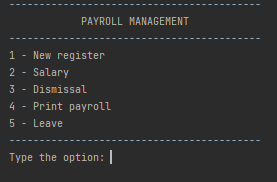
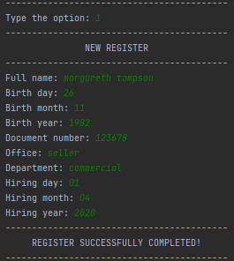
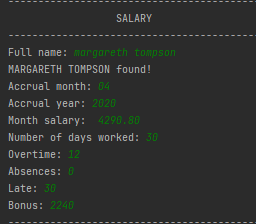
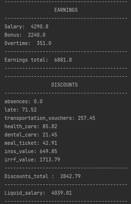
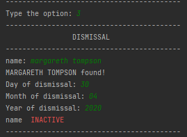
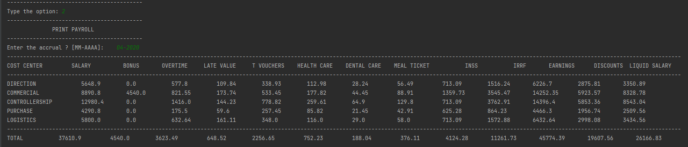
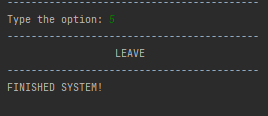

TITLE AND DESCRIPTION

Payrool

This repository consists of the registration of employees and their respective salary.

When entering the information in the option 4- Salary in the payment_menu, the system will calculate the payroll
enabling printing with totalities by cost centers of: earnings, discounts and liquid salary.


STRUCTURE OF THE REPOSITORY (TABLE OF CONTENTS)

```
Payroll
|
+---data
|       people_management.db
|
+---database
|       backup_db.py
|       create_table.py
|       import_backup_db.py
|       management_dump.sql
|       read_db.py
|       __init__.py
|
|
+---system
|      dismissal.py
|      payroll.py
|      print.py
|      register.py
|      uteis.py
|      __init__.py
|
+---main.py
|
+---readme.md
|
```

DEMONSTRATION OF THE APPLICATION


Menu




    1 - New register 



    2 - Salary        





    3 - Dismissal     



    4 - Print payroll 



    5 - Leave   




EXPLANATION OF THE FUNCTIONS

For the system to work some functions have been created which are located in the following files:

File `uteis.py`:

    -> line:                   standard line structure using '_';
    
    -> header:                 standard header structure for better visualization of information in print;
    
    -> day:                    contains rules for allowing numeric inputs from 01 to 31, as well as two-digit 
                               standardization;
    
    -> month:                  contains rules for allowing numeric inputs from 01 to 12, as well as two-digit 
                               standardization;
    
    -> year:                   contains rules for allowing numeric inputs with four-digit standardization;

    -> text_input:             for using text, blocking inputs from values;

    -> value_input:            for use of values, being standardized in float with two decimal places. 


File `register.py`:

    -> employee_register:      Through the inputs of the employees' registration information, this function will make it 
                               active in the system, storing the information in the database: people_management.db. 

    -> search_employee:         Through the name input, this function will check in the database if the employee is 
                                registered. Once registered, it will return with the employee's name and will direct in
                                then to the function payroll_calculation.Otherwise, you will have the option to register
                                being directed to the function employee_register.


File `dismissal.py`:

    -> dismissal:               Through the name input, this function will check in the database if the employee's 
                                registration is counted. Once registered, it will request the inputs of some information
                                and conclude making it inactive in the system. Otherwise, you will have the option to 
                                try the name input again or leave the system.


File `print.py`:

    -> print_payholl:           Through the competency date input, a query will be carried out with the database, 
                                returning the print of the payroll referring to the competency requested with the 
                                following totals by departments: total earnings, total discounts and total liquid salary.


File `payroll.py`: 

    -> month_salary:            Input of the employee's gross salary amount, as per the employment contract.

    -> salary:                  Using the input of the days worked, the gross salary of the month will be calculated.
                                Always considering the basis for calculating 30 days for the full salary, if the 
                                employee can your absences in the month make the calculation 
                                (30 days - absences = total days worked);


    -> inss:                    This function calculates the discount amount on the employee's payroll for the INSS. The 
                                basis for calculation (gross salary of the month + overtime) with the result of the base 
                                amount is established a rate for calculating the discount. Consultation of the rate was 
                                substantiated through the link below:
                                https://tabeladoinss2019.com/tabela-inss-2021/


    -> irrf:                    This function calculates the discount amount on the employee's payroll for the IRRF. The 
                                basis for calculation (gross salary of the month + overtime + bonus - INSS value) with 
                                the result of the base value is established a rate for calculating the discount.
                                The consultation of the rate was justified through the link below:
                                http://www.portaltributario.com.br/guia/tabelairf.html


    -> payroll_calculation:    This function performs the calculation of the payroll per employee. Salaries, discounts 
                               and resulting in the employee's net salary are calculated. For the discounts of: 
                               meal voucher, medical assistance and dental assistance were symbolic rates are used, 
                               considering that there is no mandatory provision in the law for such discounts. If 
                               provided for in a collective agreement, the employer must follow what is specified in the 
                               collective agreement, otherwise, it will be up to each employer to adopt or not the 
                               payroll deduction. For the discount of the transportation voucher, the rate of 6% was 
                               considered as provided by law. After completing the calculations, the information will be 
                               saved in the salary table located in the database people_management.db.


File `main.py`:

    
    -> payment_menu:           This is the function responsible for directing the information in the system. It contains 
                               five inputs options that are:

                               1 - New register  (directs to the file: register.py);
                               2 - Print payroll (directs to the file: print.py);
                               3 - Dismissal     (directs to the file: dismissal.py);
                               4 - Salary        (directs to the file: payroll.py);
                               5 - Leave         (responsible for finalizing the system).


DATABASE

The database used is Sqlite3. The information is stored at: 

-> Payroll
    -> data
        -> people_management.db


    -> database 
        -> create_table.py (Two tables were created in the database, which are: employees and salary)
                Staff table is made up of columns:            'full_name', 'birth_date', 'document_number', 
                                                              'hiring_date', 'dismissal_date', 'office', 'departament'. 
                                                              'status'.
    
                Salary table is composed of the columns:      'name', 'salary', 'bonus', 'extra_value', 'total_extras',
                                                              'absence_value', 'late_value', 'transportation_vouchers',
                                                              'health_care', 'dental_care', 'meal_ticket', 'inss_value', 
                                                              'irrf_value', 'total_earnings', 'total_discounts', 
                                                              'liquid_salary', 'accrual'.   


PREREQUISITES AND HOW TO RUN THE APPLICATION / TESTS

For the development of the project the following tools were used:

```
- Python3.6
- Sqlite3
```
